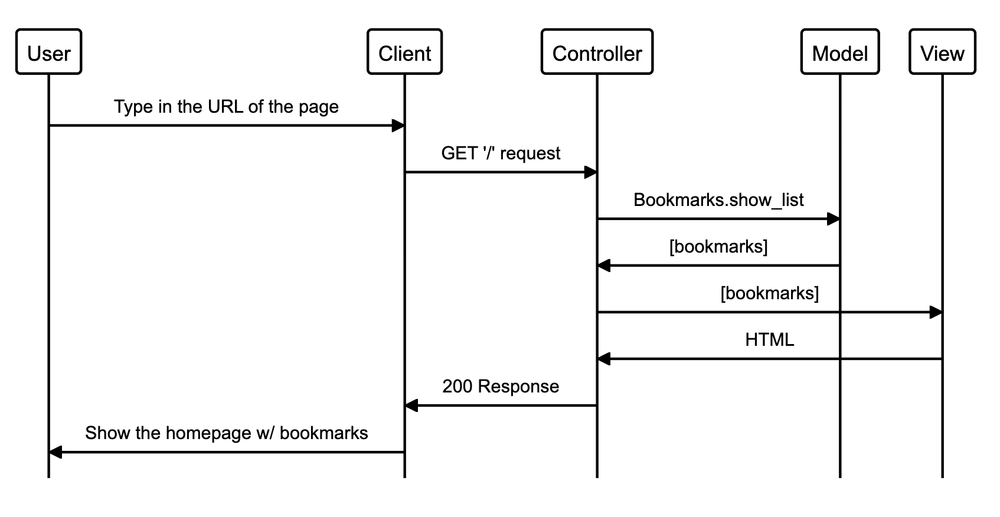
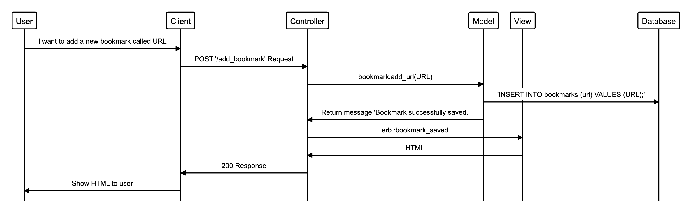

# Bookmark Manager App 

The Bookmark Manager App is a web application developed using Ruby, Sinatra, Capybara, RSpec. HTML and CSS. 

### User Stories 

| #| User Stories |
|---|---|
|1|As a user, So that I can find my favorite websites, I want to be shown a list of bookmarks.|
|2|As a user, So that I can save my favorite websites, I want to add a url in the list of bookmarks.|
----------------------------------
  

### Collaborations
In collaboration with [Margarida Martelo](https://github.com/margmartelo).